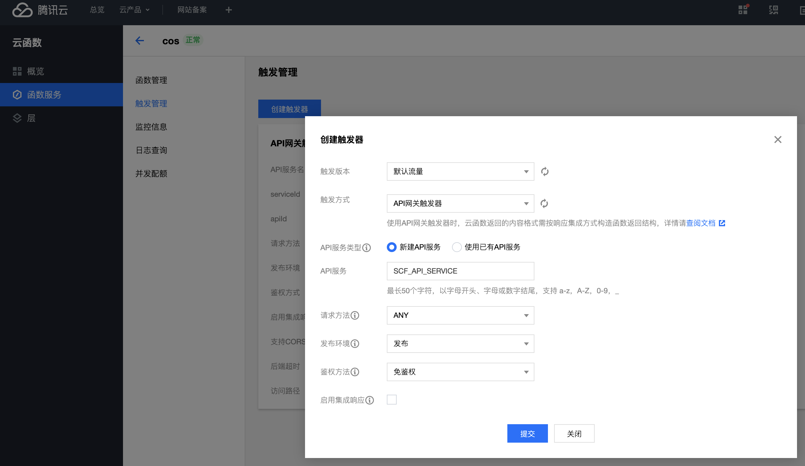
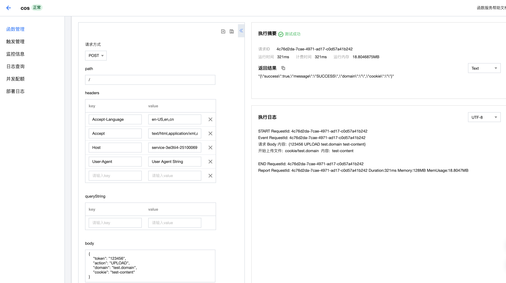

# 使用腾讯云的 Serverless 部署 API 服务

> 该项目是 [https://github.com/helloworlde/cookie](https://github.com/helloworlde/cookie) 的后端服务，用于保存从浏览器获取的 Cookie 和对外提供查询的接口
>
> 使用到了腾讯云的云函数 Serverless、对象存储 COS、以及 API 网关；请求通过 API 网关，转发给后端的 Serverless 服务，然后将 Cookie 信息以文件的形式保存在 COS 中；查询时从 COS 读取文件内容，作为响应发送出去

## 实现 Serverless 服务

在腾讯云的[Serverless服务](https://console.cloud.tencent.com/scf/list?rid=8&ns=default)中创建新的函数

### 实现

详细的 Serverless 服务实现可以参考 [https://github.com/helloworlde/weather](https://github.com/helloworlde/weather)

不同的是这是一个对外提供接口的服务，所以入参使用的是`events.APIGatewayRequest`

- main.go

```
func main() {
  cloudfunction.Start(operate)
}

func operate(request events.APIGatewayRequest) (string, error) {
    // ...
}
```

### 实现 COS 上传下载

文件的上传下载是通过 COS 的 SDK `github.com/tencentyun/cos-go-sdk-v5`
实现的，具体参考相关文档 [Go SDK](https://cloud.tencent.com/document/product/436/31215)

### 部署

在 `函数管理` => `函数配置`中添加使用到的环境变量

```shell
COS_TOKEN=xxx
COS_PATH=cookie
COS_URL=xxx
COS_SECRET_ID=xxx
COS_SECRET_KEY=xxx
```

- `COS_TOKEN` 自定义的用于鉴权的固定 Token
- `COS_PATH` 上传的文件的路径前缀，自定义
- `COS_URL` COS bucket 对外的 URL，可以在 COS bucket 的`配置管理` => `域名信息` => `访问域名` 找到
- `COS_SECRET_ID` 用于访问 COS 的 SecretID，在 [云 API](https://console.cloud.tencent.com/cam/capi) 申请
- `COS_SECRET_KEY` 用于访问 COS 的 SecreteKey，和 SecretId 一起在 [云 API](https://console.cloud.tencent.com/cam/capi) 申请

## 创建 API 网关

在函数的`触发管理`中`创建触发器`，选择 `API网关触发器`，选择`新建API服务`



然后访问生成的 `访问路径`

```bash
curl -X POST https://xxxxxxx.apigw.tencentcs.com/release/cos -d '{"token": "123456", "action": "UPLOAD", "domain": "test.domain","cookie": "test-content"}'

"{\"success\":true,\"message\":\"SUCCESS\",\"domain\":\"\",\"cookie\":\"\"}"%
```

也可以在控制台选择 `测试事件` `Api Gateway 事件模板`，修改后进行测试



说明执行成功，在 COS 中也可以看到对应的名为 `test.domain`的文件，内容是 cookie 的内容

--------

### 参考文档

- [云函数 > 开发指南](https://cloud.tencent.com/document/product/583/9206)
- [使用 API 网关快速开放 Serverless 服务](https://cloud.tencent.com/document/product/628/43941)
- [使用 API 网关提供 API 服务 ](https://cloud.tencent.com/document/product/583/13197)
- [对象存储](https://cloud.tencent.com/document/product/436)

### 项目地址

- [https://github.com/helloworlde/cos](https://github.com/helloworlde/cos)